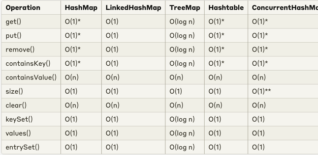

# Java Collection Framework

Set of common Data Structures available in Java out of the box

4 most common collection primitives

- List
- Set
- Queue
- Map

- Map
  - **HashMap**
    - simplest way to store key-value pairs
  - **LinkedHashMap**
    - ordering of keys based on insertion
  - **TreeMap**
    - ordering of keys based on sorting
  - **ConcurrentHashMap**
    - thread safe hashmap
  - **HashTable**
    - Legacy implementation which is thread safe

- Iterable
    - Collection
        - List
            - **ArrayList**
              - simplest way to create a list
              - faster random access through index
              - for read-heavy usage
            - **LinkedList**
              - if direct access to index not needed
              - faster insert, deletion
              - for write-heavy usage
            - **Vector**
              - thread safe access to all methods (same as arraylist)
              - slower than array list
              - **Stack**
                  - thread safe push/pop
        - Queue
            - **LinkedList**
            - **ArrayDeque**
              - doubly ended queue
              - insert/remove on both ends
              - not thread safe
            - **PriorityQueue**
              - for making a heap
              - ordered queueing
        - Set
            - **HashSet**
              - store unique elements and search them
            - **TreeSet**
              - thread safe
              - order by comparator/natural
            - **LinkedHashSet**
              - if we need ordering (insertion) of the items in a set